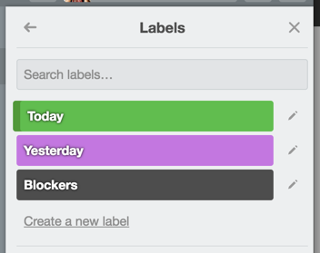
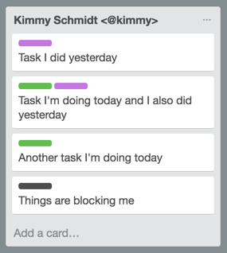
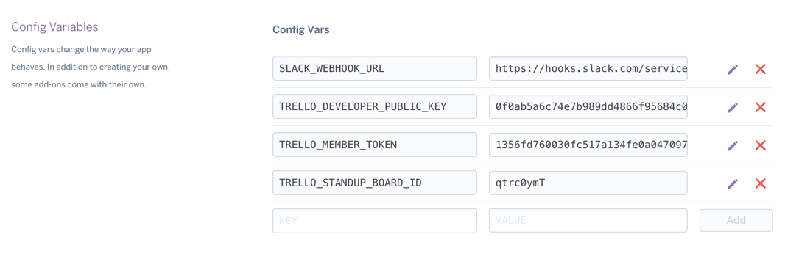

# trello-simple-standup-report
Experimenting with an asynchronous standup model, using Trello as a base. The initial implementation supports only Trello to Slack and Yammer.

## How it works
In a Trello board, make a list per person. Add the <@slack_id> if you want to notify people on slack as you post the message.

Define labels for `Yesterday`, `Today` and `Blockers`

Every person can add their tasks, labeling them properly.

You can add more detail to the tasks "Today" by adding comments. The task will render the last comment of the card.

The output will be something like this:

## Configuration
We use [ruby-trello](https://github.com/jeremytregunna/ruby-trello), follow the instructions they provide to get the API key information you need to make this work. 

If you want to post your messages to slack, you are going to need to configure a webhook. We use the gem [slack-notifier](https://github.com/stevenosloan/slack-notifier), take a look at their documentation for detailed instructions.

VARIABLE |  |
------------ | -------------
`TRELLO_DEVELOPER_PUBLIC_KEY` | Check [ruby-trello](https://github.com/jeremytregunna/ruby-trello)
`TRELLO_MEMBER_TOKEN` | Check [ruby-trello](https://github.com/jeremytregunna/ruby-trello)
`TRELLO_STANDUP_BOARD_ID` | 
`SLACK_WEBHOOK_URL` | Check [slack-notifier](https://github.com/stevenosloan/slack-notifier)
`SLACK_ANNOUNCE` | Boolean - Do you want to post the standup announcement on Slack?
`YAMMER_TOKEN` | Check [the API doc](https://developer.yammer.com/docs/test-token)
`YAMMER_GROUP` | 
`YAMMER_ANNOUNCE` | Boolean - Do you want to post the standup announcement on Yammer?

You can define all this environment variables the way you want, for our develompment environment we use [dotenv](https://github.com/bkeepers/dotenv).

## Deploying the app to Heroku
If you want to make this work in Heroku, you'll need to define the variables in your control panel.

You'll need to schedule one or two tasks, depending if you want to call for the standup or not. For that, you can use the [heroku scheduler](https://elements.heroku.com/addons/scheduler). The tasks are:
- `rake trello:callforstandup` for sending a reminder to the people of the channel
- `rake trello:standup` for collecting the data from the board and posting it.

