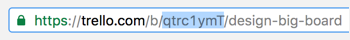

# trello-simple-standup-report

Experimenting with an asynchronous standup model, using trello as a base.

## Configuration

We use [ruby-trello](https://github.com/jeremytregunna/ruby-trello), follow the instructions they provide to get the API key information you need to make this work. 

If you want to post your messages to slack, you are going to need to configure a webhook. We use the gem [slack-notifier](https://github.com/stevenosloan/slack-notifier), take a look to their documentation for detailed instructions.

ENV VARIABLE |  |
------------ | -------------
`TRELLO_DEVELOPER_PUBLIC_KEY` | Check [ruby-trello](https://github.com/jeremytregunna/ruby-trello)
`TRELLO_MEMBER_TOKEN` | Check [ruby-trello](https://github.com/jeremytregunna/ruby-trello)
`TRELLO_STANDUP_BOARD_ID` | 
